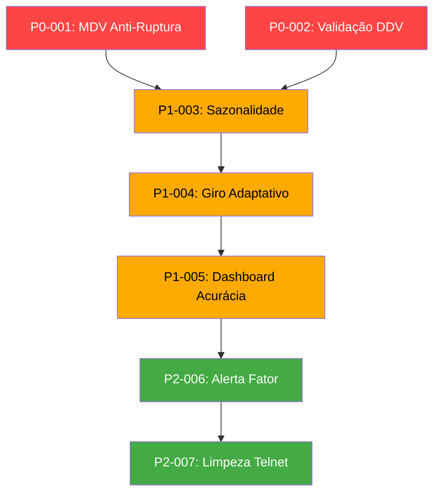

# Propostas de Implementação — Novas Features para Teste

> **Data:** 24/06/2026  
> **Priorização:** P0 = Urgente / P1 = Alta / P2 = Melhoria Futura  
> **Status:** 🔲 Não Iniciado | 🔨 Em Desenvolvimento | ✅ Concluído | ❌ Descartado

---

## P0-001 — MDV Corrigido por Ruptura (Anti-Ciclo Vicioso)
**Prioridade:** P0 — Crítico para precisão  
**Problema que resolve:** [[05-Analise_de_Melhorias#2. MDV Estático (Foto vs. Filme)]]  
**Status:** 🔲 Não Iniciado  

### Conceito
Quando uma loja está em ruptura (estoque = 0) há vários dias, o MDV do ERP cai artificialmente porque "não vendeu" (na verdade, não tinha para vender). O sistema deve detectar essa situação e **substituir o MDV** por uma estimativa mais realista.

### Regra Proposta
```python
# Se estoque da loja é 0 e o MDV está abaixo de 50% da média das outras lojas,
# assume o MDV como a mediana das lojas que TÊM estoque (> 0).
lojas_com_estoque = [l for l in lojas_processar if l['estoque'] > 0 and l['mdv'] > 0]
mediana_mdv = sorted([l['mdv'] for l in lojas_com_estoque])[len(lojas_com_estoque) // 2]

for loja in lojas_processar:
    if loja['estoque'] <= 0 and loja['mdv'] < (mediana_mdv * 0.5):
        loja['mdv'] = mediana_mdv  # Correção anti-ruptura
        loja['mdv_corrigido'] = True
```

### Onde implementar
- `ai_core.py` → método `calcular_distribuicao()`, logo após o loop que monta `lojas_processar`.

### Como testar
- Rodar com um produto que está zerado em várias lojas e verificar se o sistema agora envia quantidades compatíveis com o que as lojas de estoque positivo vendem.

---

## P0-002 — Validação Cruzada do DDV
**Prioridade:** P0  
**Problema que resolve:** [[05-Analise_de_Melhorias#3. DDV Calculado Apenas pelo ERP, Sem Validação]]  
**Status:** 🔲 Não Iniciado  

### Conceito
Calcular o DDV internamente como `estoque_loja / mdv` e comparar com o DDV reportado pelo ERP. Se a diferença for maior que 30%, usar o calculado internamente.

### Regra Proposta
```python
# Dentro do loop de lojas_processar:
ddv_calculado = info['estoque'] / info['mdv'] if info['mdv'] > 0 else 999
ddv_erp = info['ddv']

# Se o ERP está reportando algo muito diferente, confia no cálculo
if abs(ddv_calculado - ddv_erp) > (ddv_calculado * 0.3):
    info['ddv'] = ddv_calculado
    info['ddv_fonte'] = 'CALCULADO'
else:
    info['ddv_fonte'] = 'ERP'
```

### Onde implementar
- `ai_core.py` → dentro do loop de montagem de `lojas_processar`.

---

## P1-003 — Índice de Sazonalidade por Período
**Prioridade:** P1  
**Problema que resolve:** [[05-Analise_de_Melhorias#1. Sazonalidade é Praticamente Inexistente]]  
**Status:** 🔲 Não Iniciado  

### Conceito
Criar um multiplicador sazonal baseado no mês corrente. Esse multiplicador é aplicado sobre o `dias_alvo`, aumentando a cobertura em meses de pico e reduzindo em meses de baixa.

### Implementação Proposta

**Novo arquivo:** `dados/sazonalidade.json`
```json
{
  "padrao": {
    "01": 0.8,  "02": 0.7,  "03": 0.85,
    "04": 0.9,  "05": 1.0,  "06": 1.1,
    "07": 1.0,  "08": 0.9,  "09": 1.0,
    "10": 1.1,  "11": 1.3,  "12": 1.5
  },
  "categorias": {
    "protetor_solar": { "01": 1.8, "02": 1.5, "06": 0.5, "07": 0.4 },
    "chocolate": { "03": 1.6, "04": 1.8 }
  }
}
```

**No `ai_core.py`:**
```python
from datetime import datetime
import json

# No __init__:
caminho_saz = os.path.join(os.path.dirname(caminho_estoque99), 'sazonalidade.json')
if os.path.exists(caminho_saz):
    with open(caminho_saz, 'r') as f:
        self.sazonalidade = json.load(f)
else:
    self.sazonalidade = {}

# No calcular_distribuicao():
mes_atual = datetime.now().strftime("%m")
fator_sazonal = self.sazonalidade.get("padrao", {}).get(mes_atual, 1.0)
alvo_grande = int(alvo_grande * fator_sazonal)
alvo_pequena = int(alvo_pequena * fator_sazonal)
```

### Na Interface
- Mostrar o multiplicador sazonal ativo na tela (ex: "Sazonalidade: x1.3 (Novembro)").

---

## P1-004 — Giro-Alvo Adaptativo por Velocidade de Venda
**Prioridade:** P1  
**Problema que resolve:** [[05-Analise_de_Melhorias#4. Distribuição Não Considera Velocidade de Giro Relativa]]  
**Status:** 🔲 Não Iniciado  

### Conceito
Em vez de dar o mesmo `dias_alvo` para todas as lojas do grupo, usar o próprio MDV para escalar o alvo. Lojas com giro rápido recebem mais dias de cobertura (para não zerar antes da próxima reposição). Lojas com giro lento recebem menos dias.

### Regra Proposta
```python
# Classificação por velocidade de giro dentro do grupo
mdvs_grupo = [l['mdv'] for l in lojas_processar if l['mdv'] > 0 and l['perfil'] == perfil]
if mdvs_grupo:
    percentil_75 = sorted(mdvs_grupo)[int(len(mdvs_grupo) * 0.75)]
    if info['mdv'] >= percentil_75:
        # Loja de alto giro: +20% no alvo para segurar mais tempo
        dias_alvo_loja = int(dias_alvo * 1.20)
    else:
        dias_alvo_loja = dias_alvo
```

---

## P1-005 — Dashboard de Acurácia (Feedback Loop)
**Prioridade:** P1  
**Problema que resolve:** [[05-Analise_de_Melhorias#6. Ausência de Feedback Loop Real]]  
**Status:** 🔲 Não Iniciado  

### Conceito
Criar uma aba nova na interface chamada **"📊 Acurácia"** que cruze os dados do `db.csv` (o que foi enviado) com o `estoque99.csv` atual para responder:  
- "O envio de 5 dias atrás para a Loja X já foi consumido?" → Se sim, subenviamos.  
- "O envio de 5 dias atrás ainda está lá quase intacto?" → Se sim, sobreenviamos.

### Métricas a Calcular
| Métrica | Fórmula | Meta |
|---------|---------|------|
| **Taxa de Ruptura Pós-Envio** | `lojas_zeradas_7d_depois / total_lojas_abastecidas` | < 10% |
| **Taxa de Sobreestoque** | `lojas_com_ddv > 45 dias / total_lojas_abastecidas` | < 15% |
| **MAE (Erro Absoluto Médio)** | `média(|qtd_enviada - qtd_ideal|)` | Menor possível |
| **WAPE (Weighted Absolute Percentage Error)** | `soma(|erros|) / soma(reais)` | < 20% |

### Na Interface
```
ABA "📊 ACURÁCIA"
┌──────────────────────────────────────┐
│  Taxa de Ruptura 7d:    8% ✅       │
│  Taxa de Sobreestoque:  22% ⚠️      │
│  MAE:                   3.2 caixas   │
│  WAPE:                  18%          │
│                                      │
│  [Gráfico de barras por loja]        │
└──────────────────────────────────────┘
```

---

## P2-006 — Alerta de Fator Suspeito
**Prioridade:** P2  
**Problema que resolve:** [[05-Analise_de_Melhorias#5. Fator Fallback Fixo (12)]]  
**Status:** 🔲 Não Iniciado  

### Conceito
Quando o sistema usar o fallback (fator=12), marcar no log e no relatório com um ⚠️ para que o operador saiba que aquele produto pode estar com envio impreciso.

```python
if fator_produto == 12 and codigo_int not in self.fatores_mestre:
    log.warn(f"⚠️ Item {codigo}: usando fator fallback (12). Verificar cadastro mestre.")
```

---

## P2-007 — Limpeza do Código Morto (Telnet)
**Prioridade:** P2  
**Problema que resolve:** [[05-Analise_de_Melhorias#8. Importação Desnecessária do Telnet]]  
**Status:** 🔲 Não Iniciado  

### Ações
1. Remover `from modulos.bot_telnet import BotTelnet` do `interface.py`.
2. Remover o bloco `if modo_conexao == "telnet"` do `preparar_motores()`.
3. Remover a opção `"telnet"` do dropdown de configurações.
4. (Opcional) Mover `bot_telnet.py` para uma pasta `_deprecated/`.

---

## Ordem de Implementação Recomendada



> **Nota:** As features P0 podem ser implementadas imediatamente sem impacto no fluxo RPA existente. As P1 exigem testes cuidadosos com dados reais antes de entrar em produção.
